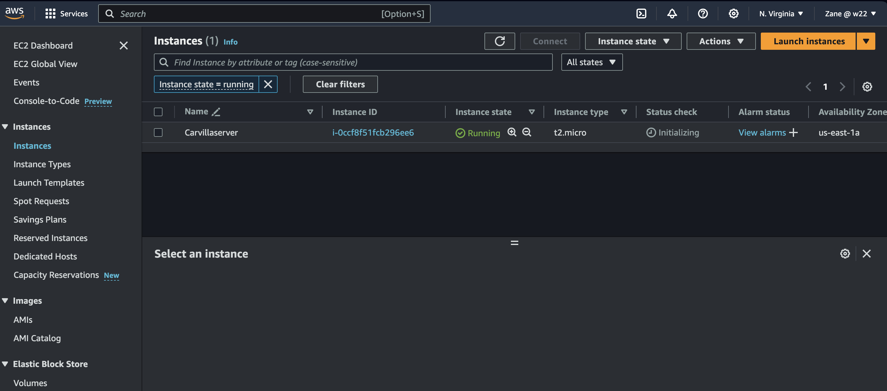
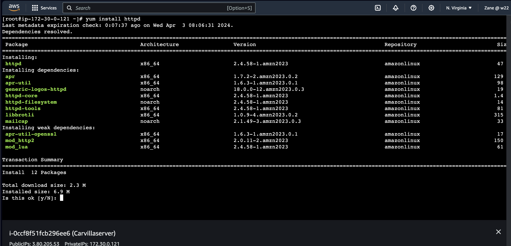
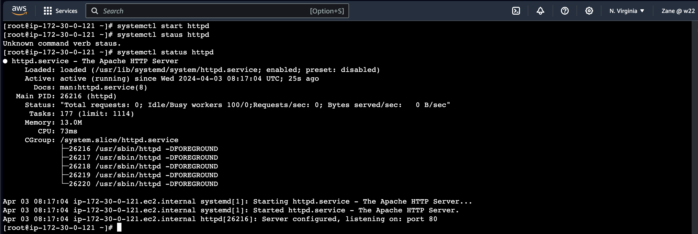
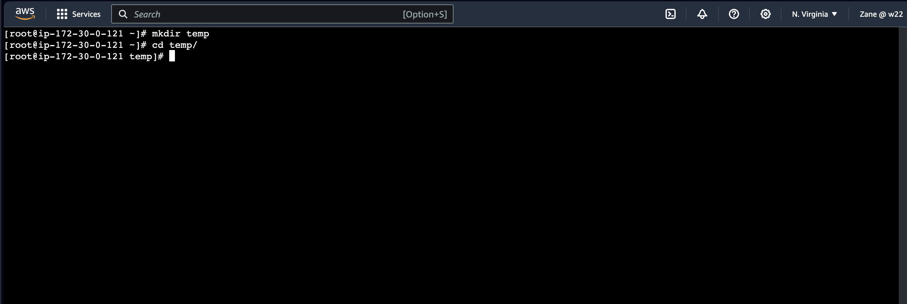

# Website-Hosting-on-EC2

This project demonstrates how to deploy a website on an Amazon EC2 instance using Linux commands.

This repository contains resources and instructions for hosting a website on an AWS EC2 instance. Follow the steps outlined below to deploy your website successfully.

# Prerequisites:

. AWS Account

. Basic knowledge of AWS services

. Basic knowledge of Linux commands

# Steps:

# 1. Create an EC2 Instance

. Navigate to the EC2 dashboard on AWS Management Console.
. Launch a new EC2 instance, choosing an appropriate instance type, AMI, and configuration.
. Ensure to configure security groups to allow inbound traffic on ports 80 (HTTP), 443 (HTTPS), and 22 (SSH) from anywhere.

# 2. Connect to EC2 Instance

Connect to your EC2 instance using SSH or Instance Connect.

# 3. Update the System

# 4. Install Web Server (Apache HTTP Server)

hit y to install Apache

# 6. Check Status of HTTPD (Apache)

# 7. Enable HTTPD

# 8. Check system running

# 9. Create a Directory

 cd temp/ after creating temp directory

# 10. Download Website Files

# 11. Unzip Website Files
# 12. Navigate to the Unzipped Directory
# 13. Check Files in the Directory
# 14. Move Files to Web Server Directory
# 15. Verify Files Moved Successfully
# 16. Test Your Website
# 17. Copy the public IP address of your EC2 instance.

# 18. Paste it into a web browser and hit enter to access your website.

# 19. Linux Commands Used:

sudo yum update -y

sudo yum install -y httpd

systemctl status httpd

sudo systemctl enable httpd

mkdir temp

cd temp

wget https://www.free-css.com/assets/files/free-css-templates/download/page296/carvilla.zip

unzip carvilla.zip

cd carvillaV1.0

ls -lrt

sudo mv * /var/www/html/

Follow these instructions carefully to successfully deploy your website on an AWS EC2 instance. For any issues or further customization, refer to the AWS documentation or seek assistance from AWS support. reach me on Github: https://github.com/UgbabeMark

   
